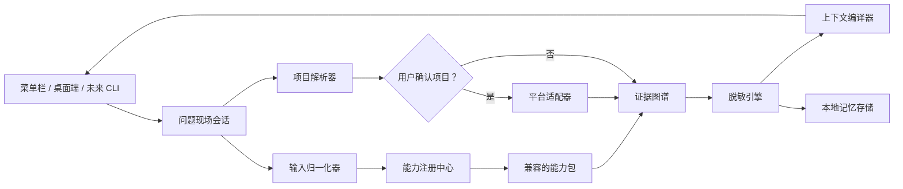

# DevTriage 产品设计

日期：2026-07-03  
状态：书面审阅稿

## 概述

DevTriage 是一个面向开发者、完全在本地运行的调试上下文编译器。用户粘贴错误、确认工具推测的项目、快速检查一份可追溯的摘要，然后复制一段可直接交给 AI 的提示词。DevTriage 不使用内置模型诊断错误，而是为外部 AI 或人类整理诊断问题所需的证据。

产品的核心承诺是：**在大约 10 秒内，一次性给 AI 足够、干净的本地上下文。**

产品体验遵循聚焦的“上下文编译器”模式。底层引擎是可扩展平台，但进程、端口、Git、历史和文件操作只有在能够增强当前问题现场时才出现。DevTriage 不是 IDE、终端、通用进程监控器，也不是自主编码 Agent。

## 已确认的产品决策

- 输入由用户主动发起。主流程从粘贴错误文本开始；DevTriage 不持续监听终端。
- 工具自动推测错误所属项目，但读取本地项目数据前必须获得用户确认。
- 分析过程确定、完全本地，不使用云端或内置大模型。
- 默认输出同时包含事实包和一个表述良好的诊断问题。
- 复制前显示极简结果供用户确认，不在用户看不到的情况下静默复制转换结果。
- 产品通过通用分析层和逐步加深的生态能力包服务所有开发技术栈。
- 官方能力包可以包含受沙箱限制的本地逻辑；社区扩展只能使用受限的声明式格式，不能执行任意代码。
- 引擎和能力协议从一开始跨平台设计，首个产品版本面向 macOS。
- 默认保存脱敏记忆；每次问题可以改为不保存，或由用户明确选择完整归档。
- 菜单栏是主要交互入口；桌面窗口用于深入查看同一个问题现场；未来 CLI 复用相同引擎和交互语义。

## 用户与核心任务

DevTriage 面向前端、后端、全栈、移动端、系统和原生开发者，尤其是以下人群：

- 经常把错误粘贴给 ChatGPT、Claude、DeepSeek 或其他 AI；
- 使用编码 Agent，但希望控制、压缩或脱敏交接上下文；
- 同时运行多个本地项目或开发进程；
- 经常需要补充命令、版本、路径、Git 状态、端口或最近变更，因而浪费调试时间；
- 希望结构化整理调试报告，但不愿给 Agent 过大的项目权限。

产品的首要用户任务是：

> 当本地开发失败时，整理出足够相关且安全的证据，让外部 AI 在第一次回复时就能给出有用判断，而不是先追问基础上下文。

## 产品原则

### 证据先于推断

每个提取字段都必须能指向输入中的原文位置，或用户已授权读取的本地来源。DevTriage 可以排序和归一化证据，但不能把没有依据的诊断包装成事实。

### 明确授权本地访问

粘贴文本不等于授权扫描项目。DevTriage 先推荐项目候选并解释匹配原因，只有在用户确认后才能读取项目。

### 如实标明能力深度

每份结果都标明它经历的是通用解析、结构化解析还是深度生态解析。无法识别的输入仍能得到有用的通用事实包，但不能被标记为已深度理解。

### 默认快速，按需展开

高频路径只包含一次项目确认和一次复制操作。细节、编辑、输出预算、运行时操作和原始证据留在展开视图中。

### 提供上下文工具，而非工具箱

进程、端口、文件、Git 变更和历史只有在与当前问题现场有关时才出现，不能发展成彼此独立的产品中心。

## 核心对象：问题现场

问题现场（Issue Context）代表一次调试现场，由五类带类型的数据组成：

1. **证据（Evidence）**：用户提交的文本、堆栈帧、诊断信息、路径、命令和经授权读取的本地事实。
2. **发现（Findings）**：从证据中得到的归一化错误、错误分组、首要业务代码帧、生态信号及它们之间的关系。
3. **环境（Environment）**：已确认项目、Git 状态、运行时版本、相关进程与端口，以及最近文件变更。
4. **转换记录（Transformations）**：去重、省略、路径归一化、token 预算裁剪和脱敏记录。
5. **输出（Output）**：选中的证据、精简事实包，以及复制给外部 AI 的默认诊断问题。

证据图谱（Evidence Graph）中的每个节点都记录：

- 类型和归一化后的值；
- 来源，以及适用时的原文范围；
- 产生该节点的能力包；
- 置信度和分析深度；
- 敏感级别；
- 相关或冲突证据的链接。

## 核心用户流程

1. 用户通过菜单栏或快捷键唤起 DevTriage，并粘贴一段错误。
2. DevTriage 先进行纯文本探测，再根据绝对路径、可识别的相对路径和最近确认过的项目推荐项目候选。
3. 用户确认推荐项目。只有在此之后，DevTriage 才能读取项目的 Git 和运行时上下文。
4. 本地引擎归一化输入，运行所有兼容的能力包，构建证据图谱，使用已授权的本地事实进行增强，脱敏敏感内容，并在默认预算内编译输出。
5. 快速面板显示首要错误、首要业务代码帧、已确认项目、分析深度标签，以及折叠、附加、省略和脱敏内容的简短摘要。
6. 用户点击 **复制给 AI**。默认输出包含事实包，以及“判断最可能原因并建议下一步诊断或修复行动”的请求。
7. 除非用户选择 **不保存**，否则保存一条脱敏记忆。复制完成后清除原始会话；如果用户明确选择 **完整归档**，则保留加密后的完整记录。

### 项目关联的降级路径

- 只有一个高可信候选：显示该候选，等待用户一键确认。
- 有多个合理候选：要求用户手动选择。
- 没有可信候选或用户拒绝访问：继续进行纯文本分析，并允许用户稍后选择 **附加项目**。

### 分析过程的降级路径

- 未识别任何生态：运行通用管线，并将结果标记为 **通用解析**。
- 一个或多个能力包失败：隔离失败能力包，保留其他能力包的有效发现，并显示降低后的分析深度。
- 缺少必要系统权限：跳过对应环境来源，并明确标记为“未采集”。

## 产品界面

### 菜单栏快速面板

快速面板承载高频的 10 秒流程：

- 粘贴或清空输入；
- 确认或更换推测出的项目；
- 查看极简结果和分析深度标签；
- 复制默认 AI 提示词；
- 打开详细视图；
- 选择脱敏保存、不保存或完整归档。

快速面板不展示全局进程列表、完整历史浏览器或常驻导航系统。

### 桌面详细窗口

桌面窗口打开当前问题现场，并提供：

- 摘要和错误分组；
- 证据及来源；
- 环境和相关运行时事实；
- 输出预览与编辑；
- 精简、标准和详细三档输出预算，分别约为 500、1,500 和 4,000 token；
- 转换记录和脱敏审阅；
- 与当前现场相关的文件、进程和端口操作；
- 搜索已保存的脱敏记忆和用户明确保存的完整归档。

快速面板默认使用标准预算。如果基本证据无法装入所选预算，上下文编译器必须保留首要错误和业务代码帧，移除优先级较低的证据，并报告省略内容。

### 未来的 CLI

CLI 复用同一个引擎、能力包、证据图谱、保存模式和输出编译器，不定义另一套分析模型。一个典型的未来流程是：`剪贴板输入 → 确认项目 → 极简确认 → 输出到标准输出或剪贴板`。

## 系统架构

### 核心引擎

跨平台核心引擎负责输入归一化、能力选择、证据图谱构建与合并、脱敏、错误指纹和输出编译。核心引擎没有网络访问权限，只能通过明确接口使用平台能力。

### 项目解析器

项目解析器在不扫描任意项目的前提下对候选进行排序。初始信号包括输入中的绝对路径、最近确认项目中的相对路径匹配，以及项目使用时间。每个候选都包含置信度和匹配原因。读取 Git 状态、文件、运行时或进程前必须获得用户确认。

### 平台适配器

平台适配器提供范围明确的操作：

- 读取运行时和工具版本；
- 读取相关监听端口和进程；
- 在操作系统允许时获取进程身份和工作目录；
- 安全打开文件；
- 读取 Git 元数据和最近变更；
- 经过重新验证后终止进程。

macOS 实现最先交付。Windows 和 Linux 实现必须满足相同接口，不能把平台特有行为泄漏到核心引擎中。

### 上下文编译器

上下文编译器根据用户意图和 token 预算选择并排序证据。默认意图是请求外部 AI 分析最可能原因并给出下一步行动。证据优先级依次为：

1. 用户目标和首要错误；
2. 首要业务代码帧和直接相关的诊断信息；
3. 已知的复现命令和运行时版本；
4. 与问题有明确关系的项目、Git、进程和端口事实；
5. 最近变更和次要证据；
6. 转换和省略摘要。

事实与指令在输出中必须结构化分离，让外部模型能够区分“发生了什么”和“需要它做什么”。

## 能力包

能力包可以组合运行。探测阶段不会选出唯一胜者；所有兼容能力包都可以向证据图谱贡献带类型的事实。

能力包示例包括：

- 通用日志清理和重复分组；
- JavaScript 堆栈；
- Metro 和 sourcemap 映射；
- iOS 崩溃报告和符号化；
- Android Logcat；
- JVM 异常和构建诊断；
- Python traceback；
- Go panic 和测试输出；
- Rust panic 和编译器诊断；
- C 与 C++ 编译器、链接器、sanitizer、调试器和崩溃输出；
- 构建在对应语言生态之上的框架和工具专用能力包。

### 官方能力包

官方能力包可以运行经过签名、受沙箱限制的本地解析代码，但不能访问网络或执行任意 shell 命令。符号化等操作必须通过平台适配器请求范围明确的能力。每个能力包都要声明支持的输入类型、输出的证据类型、所需本地能力、资源限制和分析深度标准。

### 社区规则

社区扩展使用声明式格式，可以声明受限匹配器、捕获字段、归一化规则、证据映射、关系、标签和测试样例。社区规则不能读取文件、启动进程、调用 shell、访问网络或加载原生代码。匹配器受时间和内存限制，防止资源耗尽。

安装时显示发布者、使用的规则能力、支持格式和测试状态。社区规则只有达到注册中心公开的验证标准后，才能标记为 **深度解析**。

### 合并与冲突规则

- 归一化结果相同且来源兼容的证据会被去重，同时保留所有贡献来源。
- 更具体的证据可以细化通用证据，但不能删除原证据。
- 相互矛盾的发现会作为冲突保留并关联；界面根据置信度、具体程度和已验证的本地证据选择主要显示值。
- 低置信度发现默认不进入输出，除非明确标记为不确定信息。

## 本地数据与隐私

### 当前会话

原始输入、文件片段和临时解析状态只存在于当前会话。除非用户明确选择完整归档，否则复制完成后会清除原始会话；如果用户没有复制，关闭该问题现场时清除。

### 默认脱敏记忆

默认本地记录只包含：

- 错误指纹和归一化后的脱敏摘要；
- 项目标识；
- 生态和分析深度标签；
- 时间和重复出现次数；
- 用户可选填写的解决记录；
- 安全的转换元数据。

默认记录不包含原始日志、秘密原值或复制出的文件内容。

### 完整归档

完整归档必须由用户针对单次问题明确选择，并展示醒目的风险提示。它在加密的本地数据库中保存原始输入、完整证据图谱、转换记录和生成结果。加密密钥由操作系统凭据设施保存，首个实现使用 macOS Keychain。

用户可以删除单条记录、某个项目的所有记录或整个数据存储。删除后，应用显示剩余记录数量和磁盘占用。

### 网络边界

日志、路径、仓库事实、环境信息和生成的事实包永远不会发送到 DevTriage 服务。能力包发现和更新可以使用单独的联网更新程序。分析进程与更新程序彼此隔离，避免已安装规则利用更新网络泄漏分析数据。

DevTriage 将脱敏描述为降低风险，而不是绝对保证。极简审阅只报告检测到的敏感数据类别和数量，不重新展示秘密原值。

## 与当前现场相关的运行时操作

运行时事实只有在引擎能够通过工作目录、命令行、已知运行时约定或证据中的端口引用，将其与已确认项目或错误关联时才出现。

终止进程前，DevTriage 必须重新读取并核对 PID、进程启动时间、命令和项目关系，避免因 PID 复用而误杀。确认界面要明确显示具体进程和会受影响的子进程。重新验证失败时取消操作。

## 错误处理

- 解析器和能力包彼此隔离；单个能力包失败不能使其他能力包的发现失效。
- 超大输入采用有界内存处理。截断时保留开头、结尾、主要匹配区域，并记录被省略范围。
- 非法编码和二进制片段会被归一化或省略，同时生成明确的转换记录。
- 权限失败生成“不可用”事实，而不是可能被误解为否定结果的空值。
- 展示或执行操作前刷新过期的项目、进程和端口信息。
- 只有在输出为空，或仍存在已确认但未脱敏的高风险秘密时阻止复制。其他不确定性通过审阅界面和最终输出明确展示。

## 成功指标

### 核心结果

在使用相同错误和相同外部模型的对照测试中，DevTriage 事实包相较于直接粘贴原始日志，应当显著减少 AI 为获取基础上下文而发起的追问。该指标通过离线评估和自愿用户研究衡量；DevTriage 不读取用户与 AI 的对话。

### 辅助指标

- 普通输入从粘贴到复制的中位时间不超过 10 秒。
- 大部分完成的会话不需要打开桌面详细窗口。
- 达到深度支持标准的能力包，能够满足对应生态公开的首要错误和业务代码帧提取准确率要求。
- 每个显示的发现都有有效来源。
- 持续维护的敏感数据测试集在默认输出中不存在已知未脱敏泄漏。
- 未知格式或能力包失败时，仍能生成明确标注的通用输出，而不是中止会话。

## 验证策略

### 黄金语料库

每个官方能力包都拥有版本化、合法可用、经过脱敏的语料库，覆盖真实格式、框架差异、畸形输入和预期证据图谱。快照测试同时覆盖图谱和编译后的提示词。

### 组合测试

混合输入必须同时运行多个能力包，例如 React Native、Metro、JavaScript 和 iOS 的组合，或 C++ 构建诊断与 sanitizer 输出的组合。测试验证合并、来源保留、置信度排序和冲突可见性。

### 隐私与对抗测试

测试样例注入凭据、Cookie、私钥、个人标识、内部域名、用户路径、编码后的秘密、超长行、终端控制字符、伪造堆栈、病态匹配表达式和误导性项目路径。测试覆盖脱敏、资源限制、项目授权、原始数据删除和更新程序隔离。

### 平台集成测试

平台测试覆盖项目元数据、运行时发现、端口归属、权限拒绝、进程身份、PID 复用、文件打开、凭据存储和数据删除。破坏性的进程测试只能使用专门创建、用后销毁的子进程。

### 能力包契约测试

官方和社区能力包在分发前必须通过 schema、确定性、资源、样例、来源和安全检查。每次解析器缺陷修复都必须附带回归样例。

## 交付工作流

长期产品的范围有意大于单份实现计划，因此拆成可以独立验证的工作流：

1. **引擎基础**：问题现场 schema、证据图谱、通用归一化、组合机制、脱敏、错误指纹和上下文编译器。
2. **macOS 产品外壳**：菜单栏、桌面详细窗口、项目授权、本地存储和 macOS 平台适配器。
3. **官方生态能力包**：每个能力包都是独立项目，拥有自己的语料和验收阈值。初始顺序由语料准备程度和用户需求决定，但不改变面向所有开发者的产品定位。
4. **社区扩展系统**：声明式 schema、验证器、打包、签名、更新隔离和分发政策。
5. **其他入口与平台**：复用引擎的 CLI、Windows 平台适配器和应用外壳，以及之后的 Linux 平台适配器和应用外壳。

每个官方生态能力包都需要独立的设计和实现计划。本文件定义它们共享的接口与产品行为，不假装所有生态可以作为一个任务同时交付和验证。

## 非目标

DevTriage 不会：

- 使用内置 AI 诊断或修复代码；
- 默认持续监听终端内容；
- 充当通用 IDE 或终端；
- 提供全局系统进程仪表盘；
- 替代企业日志、问题跟踪或协作平台；
- 把本地调试数据发送到托管服务；
- 在各生态能力包达到验证标准前，声称所有生态拥有相同的分析深度。
